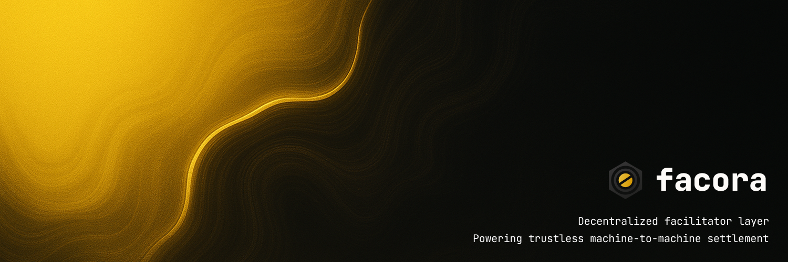

# Facora Core

**The bonded facilitator layer for x402 payments on BNB Chain.**

Facora enables gasless pay-per-request payments for APIs and AI agents. APIs return HTTP 402, users sign a permit (no gas), and a facilitator settles on-chain in USDx.

## What This Solves

Traditional x402 flows have a **single point of failure**: one facilitator goes down, all payments stop.

Facora creates a **marketplace of facilitators** that compete on fees and uptime. If one fails, clients automatically try the next. Facilitators stake FAC tokens and get slashed if they cheat.

## Architecture

\`\`\`
/contracts          Smart contracts (USDx, FacoraBondRegistry)
/operator           Facilitator implementations (Alpha, Beta, Gamma)
  /core             Shared modules (settlement, permit verification, slash detection)
  /alpha            Alpha facilitator (live on BNB testnet)
  /beta             Beta facilitator (coming soon)
/sdk                Client SDK for developers
/examples           Drop-in merchant API examples
/explorer-api       Public stats and settlement history endpoints
\`\`\`

## Live Proof (BNB Testnet)

- **USDx Token**: `0xcfFA309a5Fb3ac7419eBC8Ba4a6063Ff2a7585F5` ([View on BscScan](https://testnet.bscscan.com/token/0xcfFA309a5Fb3ac7419eBC8Ba4a6063Ff2a7585F5))
- **Facilitator Alpha**: `0x1437fE0f155b910dda7A80c64b57C1460793641F`
- **Merchant Address**: `0x183052a3526d2ebd0f8dd7a90bed2943e0126795`

All settlements are verifiable on-chain. No mocks, no simulations.

## How It Works

### 1. Merchant protects an endpoint

\`\`\`typescript
// Return 402 with facilitator list
return new Response(JSON.stringify({
  price: "1000000",  // 1 USDx
  asset: "0xcfFA309a5Fb3ac7419eBC8Ba4a6063Ff2a7585F5",
  facilitators: [
    { name: "Alpha", url: "https://api.facora.network/alpha", feeBps: 50 },
    { name: "Beta", url: "https://api.facora.network/beta", feeBps: 100 }
  ]
}), { status: 402 })
\`\`\`

### 2. Client pays via SDK

\`\`\`typescript
import { payAndRequest } from '@facora/sdk'

const result = await payAndRequest({
  url: 'https://api.example.com/secret',
  userWallet: wallet,
  tokenAddress: '0xcfFA309a5Fb3ac7419eBC8Ba4a6063Ff2a7585F5'
})

console.log(result.data)              // Unlocked content
console.log(result.settlement.txHash) // On-chain proof
\`\`\`

### 3. Facilitator settles on-chain

- User signs EIP-2612 permit (off-chain, no gas)
- Facilitator calls `permit()` + `transferFrom()` on USDx contract
- Facilitator pays gas in BNB, takes 0.5% fee
- Merchant receives 99.5% of payment in USDx
- Transaction is verifiable on BscScan

### 4. Merchant verifies and unlocks

\`\`\`typescript
import { verifySettlement } from '@facora/examples'

const isValid = await verifySettlement(
  result.settlement.txHash,
  expectedPayer,
  expectedAmount
)

if (isValid) {
  return { status: 200, data: secretContent }
}
\`\`\`

## Quick Start

### For Merchants (API Providers)

1. **Protect your endpoint** - Return 402 with facilitator list
2. **Verify settlement** - Check on-chain proof before unlocking
3. **Done** - No Stripe, no API keys, no subscriptions

See `/examples/merchant-api` for drop-in code.

### For Facilitators (Operators)

1. **Stake FAC tokens** - Register in FacoraBondRegistry
2. **Run facilitator** - Process permits and settle on-chain
3. **Earn fees** - Get paid per request (0.5%-2.0%)
4. **Get slashed** - If you cheat (double-spend, fake proof, etc.)

See `/operator/README.md` for setup guide.

### For Developers (SDK Users)

\`\`\`bash
npm install @facora/sdk
\`\`\`

\`\`\`typescript
import { payAndRequest } from '@facora/sdk'

const result = await payAndRequest({
  url: 'https://api.example.com/protected',
  userWallet: wallet,
  tokenAddress: usdxAddress
})
\`\`\`

See `/sdk/README.md` for full documentation.

## Roadmap

### ✅ Phase 1: Proof of Concept (Live Now)
- Alpha facilitator on BNB testnet
- Real USDx settlements on-chain
- SDK for client integration
- Merchant API examples

### 🚧 Phase 2: Facilitator Marketplace (Q4 2025)
- Permissionless facilitator registration
- FAC token staking and slashing
- Beta and Gamma facilitators go live
- Reputation system

### 🔮 Phase 3: Production Ready (Q4 2025)
- Multi-token support (USDT, USDC)
- Cross-chain settlements
- Batch payments for high-volume APIs
- Mainnet launch

## Why BNB Chain?

- **Low gas costs** - Facilitators can afford to pay gas for users
- **Fast finality** - 3-second blocks, instant settlement
- **EVM compatible** - Standard ERC-20 + EIP-2612 permit
- **Growing ecosystem** - AI agents, DeFi, gaming

## Security

- **Testnet only** - Do not use for production billing yet
- **Private keys** - Never exposed to client, server-side only
- **On-chain verification** - All settlements verifiable on BscScan
- **Slashing** - Facilitators lose stake if they cheat (coming in Phase 2)

## Contributing

Facora is open infrastructure. Contributions welcome:

- **Facilitator operators** - Run a facilitator, earn fees
- **Merchants** - Integrate x402 payments into your API
- **Developers** - Improve SDK, add features, fix bugs

## License

MIT

## Links

- **Contracts**: `/contracts`
- **Operator Kit**: `/operator`
- **SDK**: `/sdk`
- **Examples**: `/examples`
- **Explorer API**: `/explorer-api`
- **BNB Testnet Faucet**: https://testnet.bnbchain.org/faucet-smart
